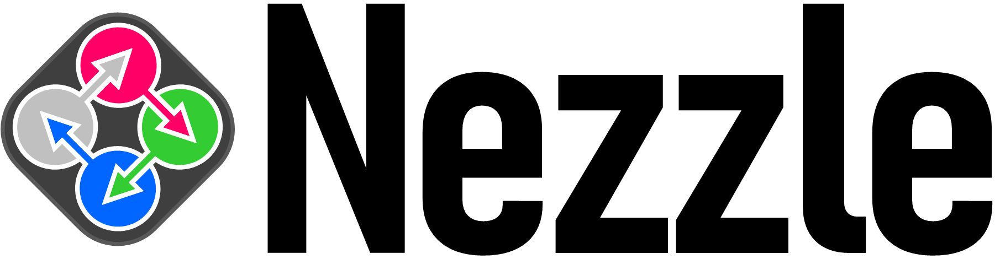

- Nezzle is a network visualization software using both GUI and Programming.
- In Nezzle, users can automate network visualization by applying their source codes, while they can manually curate network graphics through GUI.
- Nezzle repesents **Ne**t + Pu**zzle**, because adjusting nodes and edges of a network for visualization is similar to playing a puzzle.
