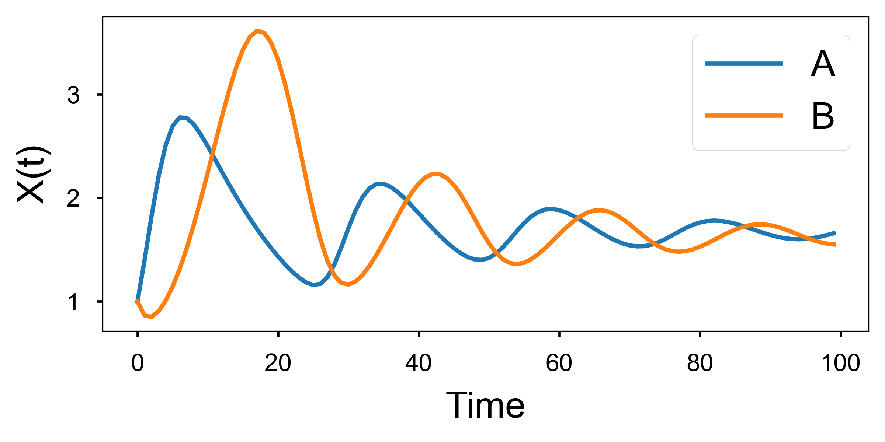
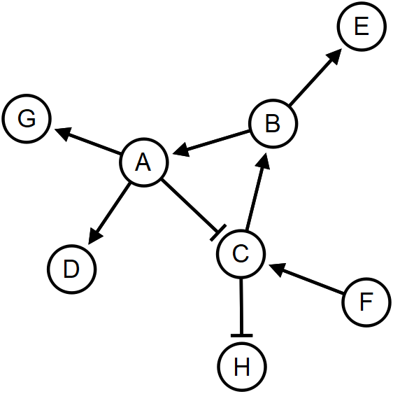

## Introduction 
- Nezzle is an interactive and programmable network visualization software.
- Nezzle was initially developed to visualize biological networks such as 
  [signaling networks](https://www.nature.com/articles/s41598-018-23643-5).
- Nezzle repesents **Ne**t + Pu**zzle**, because adjusting nodes and edges of a network for visualization is similar to doing a puzzle.
- Find helpful tutorials in Nezzle's YouTube channel [:tv:](https://www.youtube.com/channel/UC4TV7k-8ItSIvD7wUd7Hl1Q)

 
## Features
- Lightweight, programmable, detailed visualization of complex networks for high quality figures.
- Highly customizable visualization of networks with user-defined source codes.
- Easy and efficient plug-in development enabled by powerful Python ecosystem.
- Manual curation of the positions of nodes and edges by adjusting the graphics in GUI.
- Interactive programming to modify both data and graphics of networks in the GUI console.
- The GUI depends on Python bindings for [`Qt`](https://www.qt.io/)
  such as [`PyQt`](https://riverbankcomputing.com/software/pyqt)
  (abstracted by [`QtPy`](https://github.com/spyder-ide/qtpy) in this project).


## Installation

:snake: [Anaconda](https://www.anaconda.com) is recommended to use and develop Nezzle.

:warning:	Apple M1 users are encouraged to use [Rosetta Terminal](https://dev.to/courier/tips-and-tricks-to-setup-your-apple-m1-for-development-547g).

### Anaconda virtual environment

After installing anaconda, create a conda virtual environment for Nezzle.
In the following command, you can change the Python version
(e.g.,`python=3.7` or `python=3.9`).

```
conda create -n nezzle python=3.8
```

Now, we can activate our virtual environment for Nezzle as follows.

```
conda activate nezzle
```

Install `pip` for installing the dependencies.

```
conda install pip
```

### Dependency
Check packages and versions in 
[requirements](https://github.com/dwgoon/nezzle/blob/main/requirements.txt) or
[requirements for conda](https://github.com/dwgoon/nezzle/blob/main/requirements_conda.txt). 

We can install all the dependencies using `pip` with `-r` option.

```
pip install -r requirements.txt
```

We can also install the dependencies using conda with `--file` option.

```
conda install -y --file requirements_conda.txt
```

### Install from PyPI
The simplest way to install Nezzle is using `pip`.

```
pip install nezzle
```

However, the installed package with `pip` do not contain the examples.
To explore the examples, install from this GitHub repository.


### Install from GitHub repository
First, clone the recent version of this repository.

```
git clone https://github.com/dwgoon/nezzle.git nezzle
```

Now, we need to install Nezzle as a module.

```
cd nezzle
pip install -r requirements.txt
python setup.py install
```

## Execution
In a terminal, we can just type "nezzle" that is in the "Scripts" sub-directory of a Python environment.

```
nezzle
```

Alternatively, we can execute the program in the local repository as follows. 

```
python nezzle.py
```

## Examples

### [Mapping dynamics data to graphics](examples/gallery.md#Applications)

<table>
  <tr>
  <td>  
      
  </td>
  <td>  
    
  </td>
  </tr>
</table>

<table>
  <tr>
  <td>  
      
  </td>
  <td>  
    
  </td>
  </tr>
</table>

### [Finding suboptimal positions by maximizing mean pairwise distances (PyTorch)](examples/gallery.md#Applications)
<table>
  <tr>
  <td>  
    
    <br/>
    <p align="center">
      Original network before messing up the layout
    </p>
  </td>
  <td>  
      
  </td>
  </tr>
</table>


### [Iris dataset layout dynamics (scikit-learn + PyTorch)](examples/gallery.md#Applications)
<table>
  <tr>
  <td>  
    
    <br/>
    <p align="center">
      Principal component view of Iris dataset
    </p>
  </td>
  <td>  
      
  </td>
  </tr>
</table>


### Adjusting network graphics through GUI


### Adjusting network graphics by programming with REPL


### Creating network graphics by running a code


<br/>

:computer::keyboard::computer_mouse: [More examples](examples/gallery.md)


## Citation
D. Lee </br>
[Nezzle: an interactive and programmable visualization of biological networks in Python](https://academic.oup.com/bioinformatics/article/38/12/3310/6585333?login=true) </br>
*Bioinformatics* 38(12) 3310–3311 (2022). </br>
