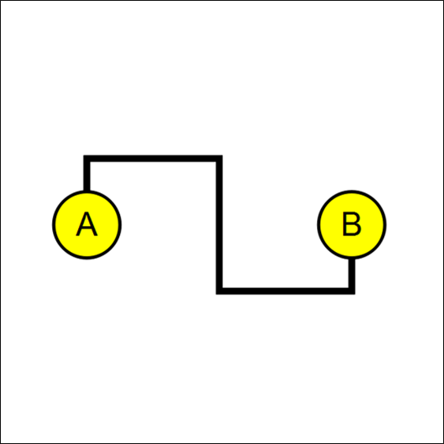

# Contents
1. [GUI Examples](#GUI-Examples)
    - [Convert node types](#Convert-node-types)
    - [Convert link types](#Convert-link-types)
    - [Undo & redo in history](#Undo-&-redo-in-history)
    - [Save & load networks](#Save-&-load-networks)    
    - [Export images](#Export-images)
    - [Copy to clipboard](#Copy-to-clipboard)

2. [Code Examples](#Code-Examples)
    - [Nodes](#Nodes)
    - [Links](#Links)
    - [Arrows](#Arrows)
    - [Labels](#Labels)
    - [Files](#Files)
    - [Applications](#Applications)


# GUI Examples

### Convert node types
<table>
<tr><td>

</td></tr>
</table>

### Convert link types
<table>
<tr><td>

</td></tr>
</table>

### Undo & redo in history


### Save & load networks


### Export images


### Copy to clipboard


# Code Examples

- Each example shows how network visualization can be automated in different ways.
- These codes are basic templates for new tasks.
- The Python source code (i.e., module) should include `update(nav, net)` function, which is called by Nezzle.
  <p></p>
- Any Python module and package can be a plugin for extending the functionality of Nezzle.
  <p></p>


### Nodes

<table>
  <tr>
    <th> Visualization </th>
    <th> Code </th>
  </tr>
  <tr>
  <td>
  
  </td>
  <td>

  ```python
  from qtpy.QtCore import Qt
  from qtpy.QtCore import QPointF

  from nezzle.graphics import EllipseNode
  from nezzle.graphics import Network


  def update(nav, net):
      net = Network("A single node")  # Overwrite the "net" variable.

      node = EllipseNode("NODE", 40, 40, pos=QPointF(0, 0))
      node["FILL_COLOR"] = Qt.yellow
      node["BORDER_COLOR"] = Qt.black
      node["BORDER_WIDTH"] = 2
      net.add_node(node)

      nav.append_item(net)
  ```

  </td>
  </tr>

  <tr>
  <td>
  
  </td>
  <td>

  ```python
  from qtpy.QtCore import Qt
  from qtpy.QtCore import QPointF
  
  from nezzle.graphics import EllipseNode
  from nezzle.graphics import TextLabel
  from nezzle.graphics import Network
  
  
  def update(nav, net):
      net = Network("A single node with a label")
  
      node = EllipseNode("NODE", 40, 40, pos=QPointF(0, 0))
      node["FILL_COLOR"] = Qt.yellow
      node["BORDER_COLOR"] = Qt.black
      node["BORDER_WIDTH"] = 2
  
      label = TextLabel(node, "A")
      label["FONT_SIZE"] = 20
      label["TEXT_COLOR"] = Qt.black
      label.align()
  
      net.add_node(node)
      net.add_label(label)
  
      nav.append_item(net)
  ```

  </td>
  </tr>

  <tr>
  <td>
  
  </td>
  <td>

  ```python
  from qtpy.QtCore import Qt
  from qtpy.QtCore import QPointF
  
  from nezzle.graphics import EllipseNode
  from nezzle.graphics import TextLabel
  from nezzle.graphics import Network
  
  
  def update(nav, net):
      net = Network("Three nodes of different colors")
      node_colors = [Qt.red, Qt.green, Qt.blue]
      text_colors = [Qt.black, Qt.black, Qt.white]
      for i, name in enumerate(["A", "B", "C"]):          
          # Node ID (i.e., iden) should be different.
          node = EllipseNode(iden=name,
                             width=40,
                             height=40,
                             pos=QPointF(-80 + 80*i, -80 + 80*i))
          node["FILL_COLOR"] = node_colors[i]
          node["BORDER_COLOR"] = Qt.black
          node["BORDER_WIDTH"] = 2
  
          label = TextLabel(node, name)
          label["FONT_SIZE"] = 20
          label["TEXT_COLOR"] = text_colors[i]
          label.align()
  
          net.add_node(node)
          net.add_label(label)
      # end of for
      nav.append_item(net)
  ```

  </td>
  </tr>

  <tr>
  <td>
  
  </td>
  <td>

  ```python
  from qtpy.QtCore import Qt
  from qtpy.QtCore import QPointF
  from qtpy.QtGui import QColor
  
  from nezzle.graphics import EllipseNode
  from nezzle.graphics import TextLabel
  from nezzle.graphics import Network
  
  
  def update(nav, net):
      net = Network("Five nodes of different sizes")
      num_nodes = 5
      for i in range(num_nodes):
          name = str(i)
          node = EllipseNode(name,
                             20 + 10*i,
                             40,
                             pos=QPointF(-200 + 80*i, -100 + 20*i))
          node["FILL_COLOR"] = QColor(153, 0, 153)
          node["BORDER_COLOR"] = Qt.black
          node["BORDER_WIDTH"] = 2
  
          label = TextLabel(node, name)
          label["FONT_SIZE"] = 16 + 2*i
          label["TEXT_COLOR"] = Qt.white
          label.align()
  
          net.add_node(node)
          net.add_label(label)
      # end of for      
      nav.append_item(net)
  ```
  </td>
  </tr>

  <tr>
  <td>
  
  </td>
  <td>

  ```python
  from qtpy.QtCore import Qt
  from qtpy.QtCore import QPointF
  from qtpy.QtGui import QColor
  
  from nezzle.graphics import EllipseNode
  from nezzle.graphics import TextLabel
  from nezzle.graphics import Network
  
  
  def update(nav, net):
      net = Network("Five rectangle nodes of different sizes")
      num_nodes = 5
      for i in range(num_nodes):
          name = str(i)
          node = EllipseNode(name,
                             20 + 10 * i,
                             40,
                             pos=QPointF(-200 + 80 * i, 100 - 20 * i))
          node["FILL_COLOR"] = QColor(153, 51, 0)
          node["BORDER_COLOR"] = Qt.black
          node["BORDER_WIDTH"] = 2
  
          label = TextLabel(node, name)
          label["FONT_SIZE"] = 16 + 2 * i
          label["TEXT_COLOR"] = Qt.white
          label.align()
  
          net.add_node(node)
          net.add_label(label)
      # end of for    
      nav.append_item(net)
  ```
  </td>
  </tr>


  <tr>
  <td>
  
  </td>
  <td>

  ```python
  import numpy as np
  from qtpy.QtCore import Qt
  from qtpy.QtCore import QPointF
  from qtpy.QtGui import QColor
  
  from nezzle.graphics import EllipseNode
  from nezzle.graphics import TextLabel
  from nezzle.graphics import Network
  
  
  def update(nav, net):
      color_white = np.array([255, 255, 255, 0])
      color_up = np.array([255, 0, 0, 0])
      color_dn = np.array([0, 0, 255, 0])
  
      num_nodes = 30
  
      x = np.random.uniform(-200, 200, num_nodes)  # X coordinates
      y = np.random.uniform(-200, 200, num_nodes)  # Y coordinates
      z = np.random.uniform(-1, 1, num_nodes)  # Some values to display in color
      abs_z = np.abs(z)
      norm_abs_z = abs_z / abs_z.max()
  
      net = Network("Node color mapping")
      for i in range(num_nodes):
          name = str(i)
          node = EllipseNode(name, 40, 40, pos=QPointF(x[i], y[i]))
  
          if z[i] > 0:
              color = color_white + norm_abs_z[i] * (color_up - color_white)
          elif z[i] <= 0:
              color = color_white + norm_abs_z[i] * (color_dn - color_white)
  
          color[3] = 255
          node["FILL_COLOR"] = QColor(*color)
          node["BORDER_COLOR"] = Qt.black
          node["BORDER_WIDTH"] = 2
  
          label_name = TextLabel(node, name)
          label_name["FONT_SIZE"] = 16
          label_name["TEXT_COLOR"] = Qt.white
          label_name.align()
  
          lightness = QColor(node["FILL_COLOR"]).lightness()
          if lightness < 200:
              label_name['TEXT_COLOR'] = Qt.white
              label_name['FONT_BOLD'] = True
          else:
              label_name['TEXT_COLOR'] = Qt.black
              label_name['FONT_BOLD'] = False
  
          net.add_node(node)
          net.add_label(label_name)
      # end of for
      nav.append_item(net)
  ```
  </td>
  </tr>
</table>

## Links
<table>
  <tr>
    <th> Visualization </th>
    <th> Code </th>
  </tr>
  <tr>
  <td>
  
  </td>
  <td>

  ```python
  from qtpy.QtCore import Qt
  from qtpy.QtCore import QPointF
  
  from nezzle.graphics import EllipseNode
  from nezzle.graphics import TextLabel
  from nezzle.graphics import StraightLink
  from nezzle.graphics import Network
  
  
  def update(nav, net):
      net = Network("A single straight edge")
  
      src = EllipseNode("SRC", 40, 40, pos=QPointF(-60, 0))
      src["FILL_COLOR"] = Qt.yellow
      src["BORDER_COLOR"] = Qt.black
      src["BORDER_WIDTH"] = 2
  
      tgt = EllipseNode("TGT", 40, 40, pos=QPointF(60, 0))
      tgt["FILL_COLOR"] = Qt.yellow
      tgt["BORDER_COLOR"] = Qt.black
      tgt["BORDER_WIDTH"] = 2
  
      link = StraightLink("LINK", src, tgt, width=4)
  
      label_src = TextLabel(src, "A")
      label_src["FONT_SIZE"] = 20
      label_src["TEXT_COLOR"] = Qt.black
      label_src.align()
  
      label_tgt = TextLabel(tgt, "B")
      label_tgt["FONT_SIZE"] = 20
      label_tgt["TEXT_COLOR"] = Qt.black
      label_tgt.align()
  
      net.add_node(src)
      net.add_node(tgt)
      net.add_link(link)
      net.add_label(label_src)
      net.add_label(label_tgt)
  
      nav.append_item(net)
  ```

  </td>
  </tr>

  <tr>
  <td>
  
  </td>
  <td>

  ```python
  from qtpy.QtCore import Qt
  from qtpy.QtCore import QPointF
  
  from nezzle.graphics import EllipseNode
  from nezzle.graphics import TextLabel
  from nezzle.graphics import CurvedLink
  from nezzle.graphics import Network
  
  
  def update(nav, net):
      net = Network("A single curved edge")
  
      src = EllipseNode("SRC", 40, 40, pos=QPointF(-80, 0))
      src["FILL_COLOR"] = Qt.yellow
      src["BORDER_COLOR"] = Qt.black
      src["BORDER_WIDTH"] = 2
  
      tgt = EllipseNode("TGT", 40, 40, pos=QPointF(80, 0))
      tgt["FILL_COLOR"] = Qt.yellow
      tgt["BORDER_COLOR"] = Qt.black
      tgt["BORDER_WIDTH"] = 2
  
      link = CurvedLink("LINK", src, tgt, width=4)
      link["CP_POS_X"] = 0
      link["CP_POS_Y"] = -80
  
      label_src = TextLabel(src, "A")
      label_src["FONT_SIZE"] = 20
      label_src["TEXT_COLOR"] = Qt.black
      label_src.align()
  
      label_tgt = TextLabel(tgt, "B")
      label_tgt["FONT_SIZE"] = 20
      label_tgt["TEXT_COLOR"] = Qt.black
      label_tgt.align()
  
      net.add_node(src)
      net.add_node(tgt)
      net.add_link(link)
      net.add_label(label_src)
      net.add_label(label_tgt)
  
      nav.append_item(net)
  ```

  </td>
  </tr>


  <tr>
  <td>
  
  </td>
  <td>

  ```python
  from qtpy.QtCore import Qt
  from qtpy.QtCore import QPointF
  
  from nezzle.graphics import EllipseNode
  from nezzle.graphics import TextLabel
  from nezzle.graphics import CurvedLink
  from nezzle.graphics import Network
  
  
  def update(nav, net):
      net = Network("A single curved edge")
  
      src = EllipseNode("SRC", 40, 40, pos=QPointF(-80, 0))
      src["FILL_COLOR"] = Qt.yellow
      src["BORDER_COLOR"] = Qt.black
      src["BORDER_WIDTH"] = 2
  
      tgt = EllipseNode("TGT", 40, 40, pos=QPointF(80, 0))
      tgt["FILL_COLOR"] = Qt.yellow
      tgt["BORDER_COLOR"] = Qt.black
      tgt["BORDER_WIDTH"] = 2
  
      link = CurvedLink("LINK", src, tgt, width=4)
      link["CP_POS_X"] = 0
      link["CP_POS_Y"] = -80
  
      label_src = TextLabel(src, "A")
      label_src["FONT_SIZE"] = 20
      label_src["TEXT_COLOR"] = Qt.black
      label_src.align()
  
      label_tgt = TextLabel(tgt, "B")
      label_tgt["FONT_SIZE"] = 20
      label_tgt["TEXT_COLOR"] = Qt.black
      label_tgt.align()
  
      net.add_node(src)
      net.add_node(tgt)
      net.add_link(link)
      net.add_label(label_src)
      net.add_label(label_tgt)
  
      nav.append_item(net)
  ```

  </td>
  </tr>

  <tr>
  <td>
  
  </td>
  <td>

  ```python
  from qtpy.QtCore import Qt
  from qtpy.QtCore import QPointF
  
  from nezzle.graphics import EllipseNode
  from nezzle.graphics import TextLabel
  from nezzle.graphics import HorizontalElbowLink
  from nezzle.graphics import Network
  
  
  def update(nav, net):
      net = Network("A single horizontal elbow edge")
  
      src = EllipseNode("SRC", 40, 40, pos=QPointF(0, -80))
      src["FILL_COLOR"] = Qt.yellow
      src["BORDER_COLOR"] = Qt.black
      src["BORDER_WIDTH"] = 2
  
      tgt = EllipseNode("TGT", 40, 40, pos=QPointF(0, 80))
      tgt["FILL_COLOR"] = Qt.yellow
      tgt["BORDER_COLOR"] = Qt.black
      tgt["BORDER_WIDTH"] = 2
  
      link = HorizontalElbowLink("LINK", src, tgt, width=4)
      link["CP0_POS_X"] = -40
      link["CP0_POS_Y"] = 0
      link["CP2_POS_X"] = 40
      link["CP2_POS_Y"] = 0
  
      label_src = TextLabel(src, "A")
      label_src["FONT_SIZE"] = 20
      label_src["TEXT_COLOR"] = Qt.black
      label_src.align()
  
      label_tgt = TextLabel(tgt, "B")
      label_tgt["FONT_SIZE"] = 20
      label_tgt["TEXT_COLOR"] = Qt.black
      label_tgt.align()
  
      net.add_node(src)
      net.add_node(tgt)
      net.add_link(link)
      net.add_label(label_src)
      net.add_label(label_tgt)
  
      nav.append_item(net)
  ```

  </td>
  </tr>

  <tr>
  <td>
  
  </td>
  <td>

  ```python
  from qtpy.QtCore import Qt
  from qtpy.QtCore import QPointF
  from qtpy.QtGui import QColor
  
  from nezzle.graphics import EllipseNode
  from nezzle.graphics import TextLabel
  from nezzle.graphics import StraightLink
  from nezzle.graphics import Triangle
  from nezzle.graphics import Hammer
  from nezzle.graphics import Network
  
  
  def update(nav, net):
      net = Network("Straight links with different alpha values")
      arrows = [Triangle(20, 20), Hammer(24, 8)]
  
      link_colors = [QColor(255, 0, 0, 100), QColor(0, 0, 255, 100)]
  
      for i in range(2):
          pos_src = QPointF(-80, 100 * i)
          src = EllipseNode("SRC%d"%(i + 1), 40, 40, pos=pos_src)
          src["FILL_COLOR"] = Qt.white
          src["BORDER_COLOR"] = Qt.black
          src["BORDER_WIDTH"] = 2
  
          pos_tgt = QPointF(80, 100 * (1 - i))
          tgt = EllipseNode("TGT%d"%(i + 1), 40, 40, pos=pos_tgt)
          tgt["FILL_COLOR"] = Qt.white
          tgt["BORDER_COLOR"] = Qt.black
          tgt["BORDER_WIDTH"] = 2
  
          arrow = arrows[i]
          link = StraightLink("LINK%d"%(i + 1), src, tgt, width=8, head=arrow)
          link["FILL_COLOR"] = link_colors[i]
  
          label_src = TextLabel(src, "S%d"%(i + 1))
          label_src["FONT_SIZE"] = 20
          label_src["TEXT_COLOR"] = Qt.black
          label_src.align()
  
          label_tgt = TextLabel(tgt, "T%d"%(i + 1))
          label_tgt["FONT_SIZE"] = 20
          label_tgt["TEXT_COLOR"] = Qt.black
          label_tgt.align()
  
          net.add_node(src)
          net.add_node(tgt)
          net.add_link(link)
          net.add_label(label_src)
          net.add_label(label_tgt)
      # end of for
      nav.append_item(net)
  ```

  </td>
  </tr>

</table>


## Arrows

<table>
  <tr>
    <th> Visualization </th>
    <th> Code </th>
  </tr>

  <tr>
  <td>
  
  </td>
  <td>

  ```python
  from qtpy.QtCore import Qt
  from qtpy.QtCore import QPointF
  
  from nezzle.graphics import EllipseNode
  from nezzle.graphics import TextLabel
  from nezzle.graphics import CurvedLink
  from nezzle.graphics import Triangle
  from nezzle.graphics import Hammer
  from nezzle.graphics import Network
  
  
  def update(nav, net):
      net = Network("Curved links with triangle and hammer arrows")
      arrows = [
          Triangle(10, 10),
          Hammer(18, 4)
      ]
  
      for i in range(2):
          src = EllipseNode("SRC%d"%(i + 1), 40, 40, pos=QPointF(-80, 80 * i))
          src["FILL_COLOR"] = "#33ccff"
          src["BORDER_COLOR"] = Qt.black
          src["BORDER_WIDTH"] = 2
  
          tgt = EllipseNode("TGT%d"%(i + 1), 40, 40, pos=QPointF(80, 80 * i))
          tgt["FILL_COLOR"] = "#ff9933"
          tgt["BORDER_COLOR"] = Qt.black
          tgt["BORDER_WIDTH"] = 2
  
          arrow = arrows[i]
          link = CurvedLink("LINK%d"%(i + 1), src, tgt, width=4, head=arrow)
          link["CP_POS_X"] = -20
          link["CP_POS_Y"] = -80
  
          label_src = TextLabel(src, "S%d"%(i + 1))
          label_src["FONT_SIZE"] = 20
          label_src["TEXT_COLOR"] = Qt.black
          label_src.align()
  
          label_tgt = TextLabel(tgt, "T%d"%(i + 1))
          label_tgt["FONT_SIZE"] = 20
          label_tgt["TEXT_COLOR"] = Qt.black
          label_tgt.align()
  
          net.add_node(src)
          net.add_node(tgt)
          net.add_link(link)
          net.add_label(label_src)
          net.add_label(label_tgt)
      # end of for  
      nav.append_item(net)  
  ```

  </td>
  </tr>

  <tr>
  <td>
  
  </td>
  <td>

  ```python
  from qtpy.QtCore import Qt
  from qtpy.QtCore import QPointF
  
  from nezzle.graphics import EllipseNode
  from nezzle.graphics import TextLabel
  from nezzle.graphics import CurvedLink
  from nezzle.graphics import Triangle
  from nezzle.graphics import Network
  
  
  def update(nav, net):
      net = Network("Curved links with triangle arrows of different sizes")
  
      for i in range(5):
          src = EllipseNode("SRC%d"%(i + 1), 40, 40, pos=QPointF(-80, 80*i))
          src["FILL_COLOR"] = "#33ccff"
          src["BORDER_COLOR"] = Qt.black
          src["BORDER_WIDTH"] = 2
  
          tgt = EllipseNode("TGT%d"%(i + 1), 40, 40, pos=QPointF(80, 80*i))
          tgt["FILL_COLOR"] = "#ff9933"
          tgt["BORDER_COLOR"] = Qt.black
          tgt["BORDER_WIDTH"] = 2
  
          arrow = Triangle(10 + 4*i, 10 + 4*i)
          link = CurvedLink("LINK%d"%(i + 1), src, tgt, width=4, head=arrow)
          link["CP_POS_X"] = -20
          link["CP_POS_Y"] = -80
  
          label_src = TextLabel(src, "S%d"%(i + 1))
          label_src["FONT_SIZE"] = 20
          label_src["TEXT_COLOR"] = Qt.black
          label_src.align()
  
          label_tgt = TextLabel(tgt, "T%d"%(i + 1))
          label_tgt["FONT_SIZE"] = 20
          label_tgt["TEXT_COLOR"] = Qt.black
          label_tgt.align()
  
          net.add_node(src)
          net.add_node(tgt)
          net.add_link(link)
          net.add_label(label_src)
          net.add_label(label_tgt)
      # end of for
  
      nav.append_item(net)
  ```

  </td>
  </tr>


  <tr>
  <td>
  
  </td>
  <td>

  ```python
  from qtpy.QtCore import Qt
  from qtpy.QtCore import QPointF
  
  from nezzle.graphics import EllipseNode
  from nezzle.graphics import TextLabel
  from nezzle.graphics import CurvedLink
  from nezzle.graphics import Hammer
  from nezzle.graphics import Network
  
  
  def update(nav, net):
      net = Network("Curved links with hammer arrows of different sizes")
  
      for i in range(5):
          src = EllipseNode("SRC%d"%(i + 1), 40, 40, pos=QPointF(-80, 80*i))
          src["FILL_COLOR"] = "#33ccff"
          src["BORDER_COLOR"] = Qt.black
          src["BORDER_WIDTH"] = 2
  
          tgt = EllipseNode("TGT%d"%(i + 1), 40, 40, pos=QPointF(80, 80*i))
          tgt["FILL_COLOR"] = "#ff9933"
          tgt["BORDER_COLOR"] = Qt.black
          tgt["BORDER_WIDTH"] = 2
  
          arrow = Hammer(14 + 6*i, 2 + 2*i)
          link = CurvedLink("LINK%d"%(i + 1), src, tgt, width=4, head=arrow)
          link["CP_POS_X"] = -20
          link["CP_POS_Y"] = -80
  
          label_src = TextLabel(src, "S%d"%(i + 1))
          label_src["FONT_SIZE"] = 20
          label_src["TEXT_COLOR"] = Qt.black
          label_src.align()
  
          label_tgt = TextLabel(tgt, "T%d"%(i + 1))
          label_tgt["FONT_SIZE"] = 20
          label_tgt["TEXT_COLOR"] = Qt.black
          label_tgt.align()
  
          net.add_node(src)
          net.add_node(tgt)
          net.add_link(link)
          net.add_label(label_src)
          net.add_label(label_tgt)
      # end of for
  
      nav.append_item(net)
  ```

  </td>
  </tr>

  <tr>
  <td>
  
  </td>
  <td>

  ```python
  from qtpy.QtCore import Qt
  from qtpy.QtCore import QPointF
  
  from nezzle.graphics import EllipseNode
  from nezzle.graphics import TextLabel
  from nezzle.graphics import StraightLink
  from nezzle.graphics import Triangle
  from nezzle.graphics import Hammer
  from nezzle.graphics import Network
  
  
  def update(nav, net):
      net = Network("Curved links with arrows of different offsets")
  
      arrows = [
          Triangle(10, 10),
          Hammer(14, 2)
      ]
  
      for i in range(5):
          for j in range(2):
              idx = 2*i + j
              
              pos_src = QPointF(-80 + 250*j, 80*i)
              src = EllipseNode("SRC%d"%(idx + 1), 40, 40, pos=pos_src)
              src["FILL_COLOR"] = "#33ccff"
              src["BORDER_COLOR"] = Qt.black
              src["BORDER_WIDTH"] = 2
  
              pos_tgt = QPointF(80 + 250*j, 80*i)
              tgt = EllipseNode("TGT%d"%(idx + 1), 40, 40, pos=pos_tgt)
              tgt["FILL_COLOR"] = "#ff9933"
              tgt["BORDER_COLOR"] = Qt.black
              tgt["BORDER_WIDTH"] = 2
  
              arrow = arrows[j]
              link = StraightLink("LINK%d"%(idx + 1), src, tgt, width=4, head=arrow)
              arrow.offset = 8 * i
  
              label_src = TextLabel(src, "S%d"%(idx + 1))
              label_src["FONT_SIZE"] = 20
              label_src["TEXT_COLOR"] = Qt.black
              label_src.align()
  
              label_tgt = TextLabel(tgt, "T%d"%(idx + 1))
              label_tgt["FONT_SIZE"] = 20
              label_tgt["TEXT_COLOR"] = Qt.black
              label_tgt.align()
  
              net.add_node(src)
              net.add_node(tgt)
              net.add_link(link)
              net.add_label(label_src)
              net.add_label(label_tgt)
      # end of for
      nav.append_item(net)
  ```

  </td>
  </tr>
</table>

## Labels
<table>
  <tr>
    <th> Visualization </th>
    <th> Code </th>
  </tr>

  <tr>
  <td>
  
  </td>
  <td>

  ```python
  from qtpy.QtCore import Qt
  from qtpy.QtCore import QPointF
  
  from nezzle.graphics import EllipseNode
  from nezzle.graphics import TextLabel
  from nezzle.graphics import Network
  
  
  def update(nav, net):
      net = Network("Labels of different alignment modes")
  
      align_modes = ["left", "center", "right",
                     "top", "middle", "bottom",
                     "top-left", "middle-left", "bottom-left",
                     "top-center", "middle-center", "bottom-center",
                     "top-right", "middle-right", "bottom-right"]
  
      for i, mode in enumerate(align_modes):
          pos_x = 150 * (i % 3)
          pos_y = 80 * (i // 3)
          node = EllipseNode(iden="NODE_%s"%(mode.upper()),
                             width=120,
                             height=40,
                             pos=QPointF(pos_x, pos_y))
          node["FILL_COLOR"] = Qt.white
          node["BORDER_COLOR"] = Qt.gray
          node["BORDER_WIDTH"] = 2
  
          label = TextLabel(node, mode)
          label["FONT_SIZE"] = 16
          label["TEXT_COLOR"] = Qt.black
  
          label.align(mode)
  
          net.add_node(node)
          net.add_label(label)
      # end of for
      nav.append_item(net)
  ```

  </td>
  </tr>

  <tr>
  <td>
  
  </td>
  <td>

  ```python
  from qtpy.QtCore import Qt
  from qtpy.QtCore import QPointF
  
  from nezzle.graphics import RectangleNode
  from nezzle.graphics import TextLabel
  from nezzle.graphics import Network
  
  
  def update(nav, net):
      net = Network("Labels of different fonts")
  
      font_settings =  [
          ("Arial", False, False),
          ("Consolas", False, False),
          ("Franklin Gothic Heavy", True, False),
          ("Arial", True, False),
          ("Consolas", True, False),
          ("Franklin Gothic Heavy", True, False),
          ("Arial", False, True),
          ("Consolas", False, True),
          ("Franklin Gothic Heavy", False, True)
      ]
  
      for i, setting in enumerate(font_settings):
          pos_x = 120 * (i % 3)
          pos_y = 80 * (i // 3)
  
          node = RectangleNode(iden="NODE%d"%(i),
                               width=80,
                               height=40,
                               pos=QPointF(pos_x, pos_y))
          node["FILL_COLOR"] = Qt.white
          node["BORDER_COLOR"] = Qt.black
          node["BORDER_WIDTH"] = 2
  
          label = TextLabel(node, "Nezzle")
          label["TEXT_COLOR"] = Qt.black
          label["FONT_SIZE"] = 20
          label["FONT_FAMILY"] = setting[0]
          label["FONT_BOLD"] = setting[1]
          label["FONT_ITALIC"] = setting[2]
          label.align()
  
          net.add_node(node)
          net.add_label(label)
      # end of for
      nav.append_item(net)
  ```

  </td>
  </tr>

  <tr>
  <td>
  
  </td>
  <td>

  ```python
  from qtpy.QtCore import Qt
  from qtpy.QtCore import QPointF
  from qtpy.QtGui import QFont
  
  from nezzle.graphics import RectangleNode
  from nezzle.graphics import TextLabel
  from nezzle.graphics import Network
  
  
  def update(nav, net):
      net = Network("Font settings using QFont")
  
      font_settings =  [
          ("Arial", QFont.Thin, False),
          ("Consolas", QFont.Thin, False),
          ("Franklin Gothic Heavy", QFont.Thin, False),
          ("Arial", QFont.Normal, False),
          ("Consolas", QFont.Normal, False),
          ("Franklin Gothic Heavy", QFont.Normal, False),
          ("Arial", QFont.Bold, True),
          ("Consolas", QFont.Bold, True),
          ("Franklin Gothic Heavy", QFont.Bold, True)
      ]
  
      for i, setting in enumerate(font_settings):
          pos_x = 120 * (i % 3)
          pos_y = 80 * (i // 3)
  
          node = RectangleNode(iden="NODE%d"%(i),
                               width=80,
                               height=40,
                               pos=QPointF(pos_x, pos_y))
          node["FILL_COLOR"] = Qt.white
          node["BORDER_COLOR"] = Qt.black
          node["BORDER_WIDTH"] = 2
  
          label = TextLabel(node, "Nezzle")
          label["TEXT_COLOR"] = Qt.black
          font = QFont(setting[0],
                       16,
                       setting[1],
                       setting[2])
          label["FONT"] = font
          label.align()
  
          net.add_node(node)
          net.add_label(label)
      # end of for
      nav.append_item(net)
  ```

  </td>
  </tr>


  <tr>
  <td>
  
  </td>
  <td>

  ```python
  from qtpy.QtCore import Qt
  from qtpy.QtCore import QPointF
  from qtpy.QtGui import QFont
  
  from nezzle.graphics import EllipseNode
  from nezzle.graphics import TextLabel
  from nezzle.graphics import Network
  
  
  def update(nav, net):
      net = Network("Labels of different colors")
  
      font_settings =  [
          ("A", "#FF0000"),
          ("B", "#FF7F00"),
          ("C", "#FFFF00"),
          ("D", "#00FF00"),
          ("E", "#0000FF"),
          ("F", "#4B0082"),
          ("G", "#9400D3"),
          ("H", "#33CCFF"),
          ("I", "#FF66CC"),
      ]
  
      for i, setting in enumerate(font_settings):
          pos_x = 80 * (i % 3)
          pos_y = 80 * (i // 3)
  
          node = EllipseNode(iden="NODE%d"%(i),
                               width=50,
                               height=50,
                               pos=QPointF(pos_x, pos_y))
          node["FILL_COLOR"] = Qt.white
          node["BORDER_COLOR"] = Qt.black
          node["BORDER_WIDTH"] = 2
  
          name = setting[0]
          label = TextLabel(node, name)
          label["TEXT_COLOR"] = setting[1]
          font = QFont("Arial", 20, QFont.Bold)
          label["FONT"] = font
          label.align()
  
          net.add_node(node)
          net.add_label(label)
      # end of for
      nav.append_item(net)
  ```

  </td>
  </tr>

</table>


## Files


<table>
  <tr>
    <th> Visualization </th>
    <th> Code </th>
  </tr>

  <tr>
  <td>
  
  </td>
  <td>

  ```python
  from qtpy.QtCore import Qt
  from qtpy.QtCore import QPointF
  
  from nezzle.graphics import EllipseNode
  from nezzle.graphics import TextLabel
  from nezzle.graphics import CurvedLink
  from nezzle.graphics import Triangle, Hammer
  from nezzle.graphics import Network
  from nezzle.fileio import write_network
  
  
  def update(nav, net):
      net = Network('2NNFL')  # 2-node negative feedback loop (2NNFL)
  
      # Create two nodes
      src = EllipseNode('A', 40, 40, pos=QPointF(-70, 0))
      src["FILL_COLOR"] = Qt.yellow
      src["BORDER_COLOR"] = Qt.black
      src["BORDER_WIDTH"] = 2
  
      tgt = EllipseNode('B', 40, 40, pos=QPointF(70, 0))
      tgt["FILL_COLOR"] = Qt.yellow
      tgt["BORDER_COLOR"] = Qt.black
      tgt["BORDER_WIDTH"] = 2
  
      net.add_node(src)
      net.add_node(tgt)
  
      head = Triangle(width=10, height=10, offset=4)
      link1 = CurvedLink("LINK1", src, tgt, width=4, head=head)
      link1["FILL_COLOR"] = Qt.black
      link1["CP_POS_X"] = -10
      link1["CP_POS_Y"] = -50
  
      head = Hammer(width=16, height=3, offset=4)
      link2 = CurvedLink("LINK2", tgt, src, width=4, head=head)
      link2["FILL_COLOR"] = Qt.black
      link2["CP_POS_X"] = 10
      link2["CP_POS_Y"] = 50
  
      net.add_link(link1)
      net.add_link(link2)
  
      for node in [src, tgt]:
          label = TextLabel(node, node.iden)
          label["FONT_SIZE"] = 20
          label.align()
          net.add_label(label)
      # end of for
  
      
      # Not appending the new network to the navigation.
      # You should use *.json to save the graphics information.
      write_network(net, "2nnfl.json")  

  ```

  </td>
  </tr>

  <tr>
  <td>
  
  </td>
  <td>

  ```python
  from qtpy.QtCore import Qt
  from qtpy.QtCore import QPointF
  
  from nezzle.graphics import EllipseNode
  from nezzle.graphics import TextLabel
  from nezzle.graphics import CurvedLink
  from nezzle.graphics import Triangle, Hammer
  from nezzle.graphics import Network
  from nezzle.fileio import write_image
  
  
  def update(nav, net):
      net = Network('2NNFL')  # 2-node negative feedback loop (2NNFL)
  
      # Create two nodes
      src = EllipseNode('A', 40, 40, pos=QPointF(-70, 0))
      src["FILL_COLOR"] = Qt.yellow
      src["BORDER_COLOR"] = Qt.black
      src["BORDER_WIDTH"] = 2
  
      tgt = EllipseNode('B', 40, 40, pos=QPointF(70, 0))
      tgt["FILL_COLOR"] = Qt.yellow
      tgt["BORDER_COLOR"] = Qt.black
      tgt["BORDER_WIDTH"] = 2
  
      net.add_node(src)
      net.add_node(tgt)
  
      head = Triangle(width=10, height=10, offset=4)
      link1 = CurvedLink("LINK1", src, tgt, width=4, head=head)
      link1["FILL_COLOR"] = Qt.black
      link1["CP_POS_X"] = -10
      link1["CP_POS_Y"] = -50
  
      head = Hammer(width=16, height=3, offset=4)
      link2 = CurvedLink("LINK2", tgt, src, width=4, head=head)
      link2["FILL_COLOR"] = Qt.black
      link2["CP_POS_X"] = 10
      link2["CP_POS_Y"] = 50
  
      net.add_link(link1)
      net.add_link(link2)
  
      for node in [src, tgt]:
          label = TextLabel(node, node.iden)
          label["FONT_SIZE"] = 20
          label.align()
          net.add_label(label)
      # end of for
  
      # Not appending the new network to the navigation.
      # Adjust DPI and scale for obtaining a high-quality image.
      write_image(net,
                  "2nnfl.png",
                  dpi_width=300, dpi_height=300,
                  scale_width=200, scale_height=200)
  ```

  </td>
  </tr>


</table>

## Applications

<table>
  <tr>
    <th> Visualization </th>
    <th> Code </th>
  </tr>


  <tr>
  <td>
  <p>
  
  </p>
  <p>
  
  </p>
  </td>
  <td>

  ```python
  import numpy as np
  from scipy.integrate import odeint
  import moviepy.editor as mpy
  
  from qtpy.QtCore import Qt
  from qtpy.QtCore import QPointF
  from qtpy.QtGui import QColor
  
  from nezzle.graphics import EllipseNode
  from nezzle.graphics import TextLabel
  from nezzle.graphics import CurvedLink
  from nezzle.graphics import Triangle, Hammer
  from nezzle.graphics import Network
  from nezzle.fileio import write_image
  
  
  def create_network(pos_x, pos_y, s):
      color_white = np.array([255, 255, 255, 0])
      color_up = np.array([255, 0, 0, 0])
      color_dn = np.array([0, 0, 255, 0])
  
      net = Network('2NNFL')
      src = EllipseNode('A', 40, 40, pos=QPointF(pos_x[0], pos_y[0]))
      tgt = EllipseNode('B', 40, 40, pos=QPointF(pos_x[1], pos_y[1]))
  
      net.add_node(src)
      net.add_node(tgt)
  
      head = Triangle(width=10, height=10, offset=4)
      link1 = CurvedLink("LINK1", src, tgt, width=4, head=head)
      link1["FILL_COLOR"] = Qt.black
      link1["CP_POS_X"] = -10
      link1["CP_POS_Y"] = -50
  
      head = Hammer(width=16, height=3, offset=4)
      link2 = CurvedLink("LINK2", tgt, src, width=4, head=head)
      link2["FILL_COLOR"] = Qt.black
      link2["CP_POS_X"] = 10
      link2["CP_POS_Y"] = 50
  
      net.add_link(link1)
      net.add_link(link2)
  
      for i, node in enumerate([src, tgt]):
  
          if s[i] > 0.5:
              color = color_white + s[i] * (color_up - color_white)
          else:
              color = color_white + s[i] * (color_dn - color_white)
  
          color[3] = 255
          node["FILL_COLOR"] = QColor(*color)
          node["BORDER_COLOR"] = Qt.black
          node["BORDER_WIDTH"] = 2
          node["WIDTH"] = node["HEIGHT"] = 20 + 50 * s[i]
  
          label_name = TextLabel(node, node.iden)
          label_name["FONT_SIZE"] = 10 + 30 * s[i]
          label_name["TEXT_COLOR"] = Qt.white
          label_name.align()
  
          lightness = QColor(node["FILL_COLOR"]).lightness()
          if lightness < 200:
              label_name["TEXT_COLOR"] = Qt.white
              label_name["FONT_BOLD"] = True
          else:
              label_name["TEXT_COLOR"] = Qt.black
              label_name["FONT_BOLD"] = False
  
          net.add_label(label_name)
      # end of for
      return net
  
  
  def create_movie(fpaths, fout):
      clips = []
      for fpath in fpaths:
          img = mpy.ImageClip(fpath).set_duration(0.2)
          clips.append(img)
  
      concat_clip = mpy.concatenate_videoclips(clips,
                                               bg_color=(255, 255, 255),
                                               method="compose")
      concat_clip.write_gif(fout, fps=30)
  
  
  def update(nav, net):
  
      # Solve the ODE of 2-node negative feedback loop model
      def ode(y, t):
          dydt = np.zeros(y.shape)
          ka1 = 0.8
          Km1 = 1.0
          kd1 = 0.06
          ka2 = 0.95
          Km2 = 1.0
          kd2 = 0.7
          dydt[0] = ka1/(y[1]**4 + Km1**4) - kd1*y[0]
          dydt[1] = ka2*y[1]*y[0]**2/(y[0]**2 + Km2**2) - kd2*y[1]
          return dydt
  
      t = np.arange(0, 100, 1)
      y0 = np.array([1., 1.])
      sol = odeint(ode, y0, t)
  
      norm_s = sol / sol.max()
  
      pos_x = np.array([-80.0, 80.0])
      pos_y = np.array([0.0, 0.0])
  
      fpaths = []
      for i, s in enumerate(norm_s):
          net = create_network(pos_x, pos_y, s)
          fpath = "2nnfl-dynamics-%03d.png"%(i)
          fpaths.append(fpath)
          write_image(net,
                      fpath,
                      transparent=False,
                      scale_width=200, scale_height=200)
      # end of for
  
      create_movie(fpaths, "2nnfl-dynamics.gif")
  ```

  </td>
  </tr>

  <tr>
  <td>
  <p>
  
  </p>
  <p>
  
  </p>
  </td>
  <td>

  ```python
  import numpy as np
  from scipy.integrate import odeint
  import moviepy.editor as mpy
  
  from qtpy.QtCore import Qt
  from qtpy.QtCore import QPointF
  from qtpy.QtGui import QColor
  
  from nezzle.graphics import EllipseNode
  from nezzle.graphics import TextLabel
  from nezzle.graphics import CurvedLink
  from nezzle.graphics import Triangle, Hammer
  from nezzle.graphics import Network
  from nezzle.fileio import write_image
  
  
  def create_network(pos_x, pos_y, state, norm_abs_state):
      color_white = np.array([255, 255, 255, 0])
      color_up = np.array([255, 0, 0, 0])
      color_dn = np.array([0, 0, 255, 0])
  
      net = Network('2NNFL')
      x = EllipseNode('X', 40, 40, pos=QPointF(pos_x[0], pos_y[0]))
      y = EllipseNode('Y', 40, 40, pos=QPointF(pos_x[1], pos_y[1]))
      z = EllipseNode('Z', 40, 40, pos=QPointF(pos_x[2], pos_y[2]))
  
      net.add_node(x)
      net.add_node(y)
      net.add_node(z)
  
      head = Triangle(width=10, height=10, offset=4)
      link1 = CurvedLink("LINK1", x, y, width=4, head=head)
      link1["FILL_COLOR"] = Qt.black
      link1["CP_POS_X"] = -10
      link1["CP_POS_Y"] = -50
  
      head = Triangle(width=10, height=10, offset=4)
      link2 = CurvedLink("LINK2", y, x, width=4, head=head)
      link2["FILL_COLOR"] = Qt.black
      link2["CP_POS_X"] = 10
      link2["CP_POS_Y"] = 40
      
      head = Triangle(width=10, height=10, offset=4)
      link3 = CurvedLink("LINK3", y, z, width=4, head=head)
      link3["FILL_COLOR"] = Qt.black
      link3["CP_POS_X"] = -28
      link3["CP_POS_Y"] = -28
      
      head = Hammer(width=14, height=4, offset=4)
      link4 = CurvedLink("LINK3", z, y, width=4, head=head)
      link4["FILL_COLOR"] = Qt.black
      link4["CP_POS_X"] = 45
      link4["CP_POS_Y"] = 40
      
      head = Triangle(width=10, height=10, offset=4)
      link5 = CurvedLink("LINK3", z, x, width=4, head=head)
      link5["FILL_COLOR"] = Qt.black
      link5["CP_POS_X"] = -45
      link5["CP_POS_Y"] = 40
      
      net.add_link(link1)
      net.add_link(link2)
      net.add_link(link3)
      net.add_link(link4)
      net.add_link(link5)
  
      for i, node in enumerate([x, y, z]):
          if state[i] > 0.0:
              color = color_white + norm_abs_state[i] * (color_up - color_white)
          else:
              color = color_white + norm_abs_state[i] * (color_dn - color_white)
  
          color[3] = 255
          node["FILL_COLOR"] = QColor(*color)
          node["BORDER_COLOR"] = Qt.black
          node["BORDER_WIDTH"] = 2
          node["WIDTH"] = node["HEIGHT"] = 20 + 50 * norm_abs_state[i]
  
          label_name = TextLabel(node, node.iden)
          label_name["FONT_SIZE"] = 10 + 30 * norm_abs_state[i]
          label_name["TEXT_COLOR"] = Qt.white
          label_name.align()
  
          lightness = QColor(node["FILL_COLOR"]).lightness()
          if lightness < 200:
              label_name["TEXT_COLOR"] = Qt.white
              label_name["FONT_BOLD"] = True
          else:
              label_name["TEXT_COLOR"] = Qt.black
              label_name["FONT_BOLD"] = False
  
          net.add_label(label_name)
      # end of for
      return net
  
  
  def create_movie(fpaths, fout):
      clips = []
      for fpath in fpaths:
          img = mpy.ImageClip(fpath).set_duration(0.2)
          clips.append(img)
  
      concat_clip = mpy.concatenate_videoclips(clips,
                                               bg_color=(255, 255, 255),
                                               method="compose")
      concat_clip.write_gif(fout, fps=30)
  
  
  def update(nav, net):
  
      # Solve the ODE of Lorenz system
      def ode(s, t):
          sigma = 10
          beta = 2.667
          rho = 28
          x, y, z = s
          return [sigma * (y - x), x * (rho - z) - y, x * y - beta * z]
      
      t = np.arange(0, 100, 0.1)
      y0 = np.array([0, 1, 1.05])
      s = odeint(ode, y0, t)
  
      abs_s = np.abs(s)
      norm_abs_s = abs_s / abs_s.max(axis=0)
  
      pos_x = np.array([-100.0, 100.0, 0.0])
      pos_y = np.array([0.0, 0.0, 120.0])
  
      fpaths = []
      for i, (state, norm_abs_state) in enumerate(zip(s, norm_abs_s)):
          net = create_network(pos_x, pos_y, state, norm_abs_state)
          nav.append_item(net)
          fpath = "lorenz-dynamics-%03d.png"%(i)
          fpaths.append(fpath)
          write_image(net,
                      fpath,
                      transparent=False,
                      scale_width=200, scale_height=200)
      # end of for
  
      create_movie(fpaths, "lorenz-dynamics.gif")
  ```

  </td>
  </tr>

  <tr>
  <td>
  <p>
  
  </p>
  <p>
  
  </p>
  </td>
  <td>

  ```python
  import os
  import os.path as osp
  from datetime import datetime
  
  import numpy as np
  import torch
  import torch.nn as nn
  import torch.optim as optim
  import torch.nn.functional as F
  import moviepy.editor as mpy
  
  from nezzle.fileio import write_image
  
  
  class MeanPairwiseDistances(nn.Module):
  
      def __init__(self, pos, device="cpu"):
          super().__init__()
  
          self.pos = nn.Parameter(torch.tensor(pos),
                                  requires_grad=True)
  
          self.pos = self.pos.to(device)
  
      def forward(self):
          return F.pdist(self.pos).mean()
  
  
  def create_movie(fpaths, fout):
      clips = []
      duration = 0.05
      for (epoch, fpath) in fpaths:
          img_clip = mpy.ImageClip(fpath)
          img_clip = img_clip.set_duration(duration)
          img_clip = img_clip.resize(width=412, height=412)
          img_clip = img_clip.margin(100, color=(255, 255, 255))
  
          txt_clip = mpy.TextClip("Epoch=%03d"%(epoch), fontsize=16, color='black')
          txt_clip = txt_clip.set_duration(duration)
          txt_clip = txt_clip.set_position(("center", "bottom"))
  
          clip = mpy.CompositeVideoClip([img_clip, txt_clip], bg_color=(255, 255, 255))
          clips.append(clip)
  
      concat_clip = mpy.concatenate_videoclips(clips,
                                               bg_color=(255, 255, 255),
                                               method="compose")
      concat_clip.write_gif(fout, fps=10)
  
  
  def update(nav, net):
      num_nodes = len(net.nodes)
      positions = np.zeros((num_nodes, 2))
  
      for i, (iden, node) in enumerate(net.nodes.items()):
          positions[i, :] = (node["POS_X"], node["POS_Y"])
      # end of for
  
      # Layout by maximizing mean pairwise distances (MPD) (== minimizing the negative MPD).
      model = MeanPairwiseDistances(positions)
      optimizer = optim.SGD(model.parameters(), lr=2e-1, momentum=0.5)
  
      dpath = osp.join(osp.dirname(__file__), "temp-images")
      os.makedirs(dpath, exist_ok=True)
  
      fpaths_img = []
      n_epoch = 1000
      for epoch in range(n_epoch):
          optimizer.zero_grad()
  
          loss = -1 * model()
          print("[Epoch #%d] Loss: %.3f" % (epoch + 1, loss.item()))
  
          loss.backward()
          optimizer.step()
  
          if epoch % 5 == 0:
              positions = model.pos.cpu().detach().numpy()
  
              net = net.copy()
              for i, (iden, node) in enumerate(net.nodes.items()):
                  node["POS_X"] = positions[i, 0]
                  node["POS_Y"] = positions[i, 1]
  
              fpath = osp.join(dpath, "%s-layout-%03d.jpg" % (net.name, epoch))
              fpaths_img.append((epoch, fpath))
              write_image(net,
                          fpath,
                          scale_width=200,
                          scale_height=200)
          # end of if
      # end of for
  
      create_movie(fpaths_img, osp.join(dpath, "%s-layout-dynamics.gif")%(net.name))
  
      time_stamp = datetime.now().strftime("%Y-%m-%d %H:%M:%S")
      net.name = "%s (%s)"%(net.name, time_stamp)
      nav.append_item(net)

  ```

  </td>
  </tr>

</table>
